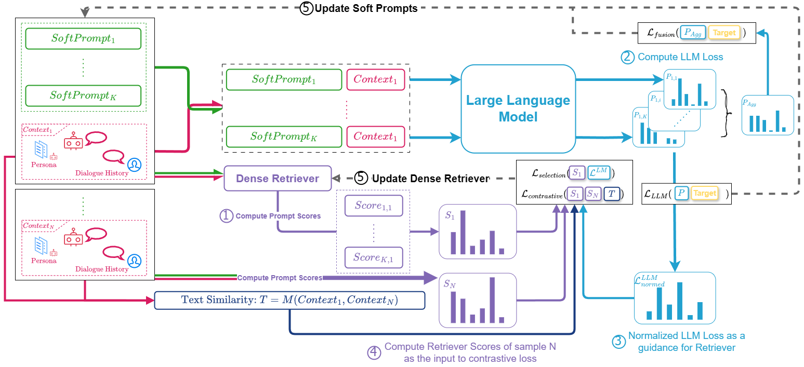
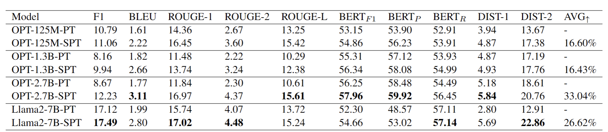

# SPT: Selective Prompting Tuning for Personalized Conversations with LLMs
Repo for `Selective Prompting Tuning for Personalized Conversations with LLMs`, the paper is available at: [Selective Prompting Tuning for Personalized Conversations with LLMs](https://openreview.net/pdf?id=Royo7My_EJ)
## Introduction

In conversational AI, personalizing dialogues with persona profiles and contextual understanding is essential. Despite large language models' (LLMs) improved response coherence, effective persona integration remains a challenge. In this work, we first study two common approaches for personalizing LLMs: textual prompting and direct fine-tuning. We observed that textual prompting often struggles to yield responses that are similar to the ground truths in datasets, while direct fine-tuning tends to produce repetitive or overly generic replies. To alleviate those issues, we propose **S**elective **P**rompt **T**uning (SPT), which softly prompts LLMs for personalized conversations in a selective way. Concretely, SPT initializes a set of soft prompts and uses a trainable dense retriever to adaptively select suitable soft prompts for LLMs according to different input contexts, where the prompt retriever is dynamically updated through feedback from the LLMs. Additionally, we propose context-prompt contrastive learning and prompt fusion learning to encourage the SPT to enhance the diversity of personalized conversations. Experiments on the CONVAI2 dataset demonstrate that SPT significantly enhances response diversity by up to 90\%, along with improvements in other critical performance indicators. Those results highlight the efficacy of SPT in fostering engaging and personalized dialogue generation. The SPT model code is publicly available for further exploration. 

## Architecture


## Experimental Results


## Repo Details
### Basic Project Structure
- `config`: contains all the configuration yml file from OPT-125M to Llama2-13B
- `data_file`: contains CONVAI2 dataset files, dataset can be donwloaded in this [Huggingface Repo](https://huggingface.co/hqsiswiliam/SPT)
- `dataset`: contains dataloader class and the pre-process methods
- `models`: contains SPT model classes
- `trainer`: contains trainer classes, responsible for model training & updating
- `utils`: provides helper classes and functions
- `test.py`: the entrance script for model decoding
- `train.py`: the entrance script for model training
### Checkpoint downloading
- The trained checkpoint is located in `public_ckpt` from [Huggingface Repo](https://huggingface.co/hqsiswiliam/SPT)

### Environment Initialization
#### Modifying `env.yml`
Since Deepspeed requires the CuDNN and CUDA, and we integrated Nvidia related tools in Anancoda, so it is essential to modify `env.yml`'s instance variable in the last two lines as:
```yml
variables:
  LD_LIBRARY_PATH: <CONDA_PATH>/envs/SPT/lib
  LIBRARY_PATH: <CONDA_PATH>/envs/SPT/lib
```
Please replace `<CONDA_PATH>` to your own actual conda installation path before importing the `env.yml` to your environment.
#### Environment Creation
The SPT's environment can be built using Anaconda (which we recommend), we provide the env.yml for environment creation:
```bash
conda env create -f env.yml
```

```bash
conda activate SPT
```
## Model Training
Using following command to start training:
```bash
deepspeed --num_nodes=1 train.py \
--config=config/convai2/opt-125m-selective-linear-both-prompt-causal-convai2.yml \
--batch=2 \
--lr=0.0001 \
--epoch=1 \
--save_model=yes \
--num_workers=0 \
--training_ratio=1.0 \
--log_dir=runs_ds_dev \
--deepspeed \
--deepspeed_config ds_config.json
```
You can adjust `--num_nodes` if you have multiple GPUs in one node
### Main Arguments
- `config`: the training configuration file
- `batch`: the batch size per GPU
- `lr`: learning rate
- `epoch`: epoch number
- `save_model`: whether to save model
- `training_ratio`: the percentage of data used for training, 1.0 means 100%
- `log_dir`: the log and model save directory
- `deepspeed & --deepspeed_config`: the necessary arguments for initialize deepspeed
- `selective_loss_weight`: weight for selection loss
- `contrastive_weight`: weight for contrastive loss
## Model Inference
Model inference can be easily invoked by using the following command:
```bash
deepspeed test.py \
--model_path=public_ckpt/OPT-125M-SPT \
--batch_size=16 \
--skip_exists=no \
--deepspeed \
--deepspeed_config ds_config.json
```
### Main Arguments
- `model_path`: the path to the checkpoint, containing the `ds_ckpt` folder
- `skip_exists`: whether to skip decoding if `evaluation_result.txt` exists

## Computing Metrics for Generation Results
To compute the metric for the evaluation results, simply run: 

`python evaluate_runs_results.py`

The input path can be changed in the script via:
```python
_main_path = 'public_ckpt'
```

## Interactive Testing
Also, we support interactive testing via:
```bash
deepspeed interactive_test.py \
--model_path=public_ckpt/Llama2-7B-SPT \
--batch_size=1 \
--deepspeed \
--deepspeed_config ds_config.json
```
So an interactive interface will be invoked as:

Some shortcut keys:
- `exit`: exiting the interactive shell
- `clear`: clear the current dialog history
- `r`: reload SPT's persona

## Citation
Will be available soon.